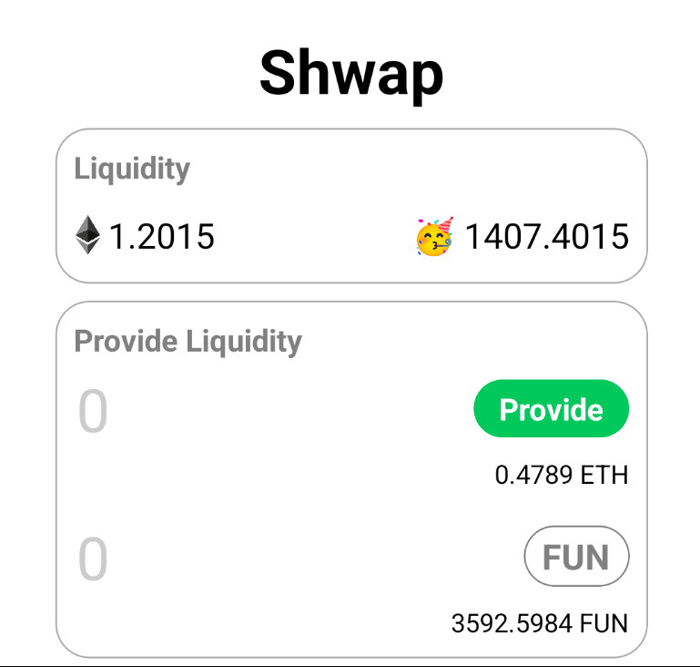
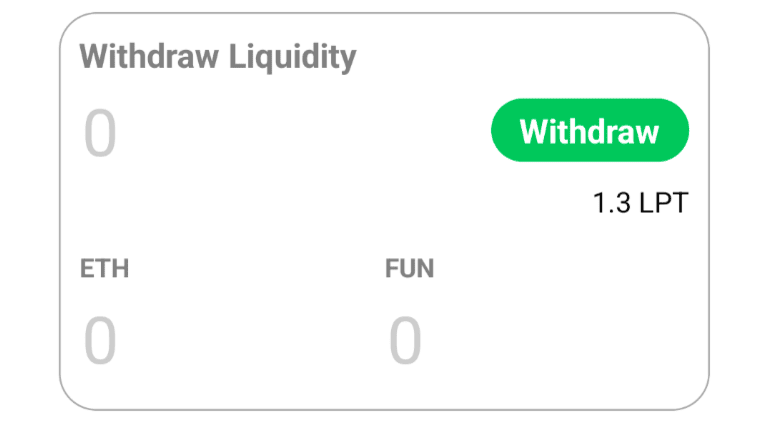
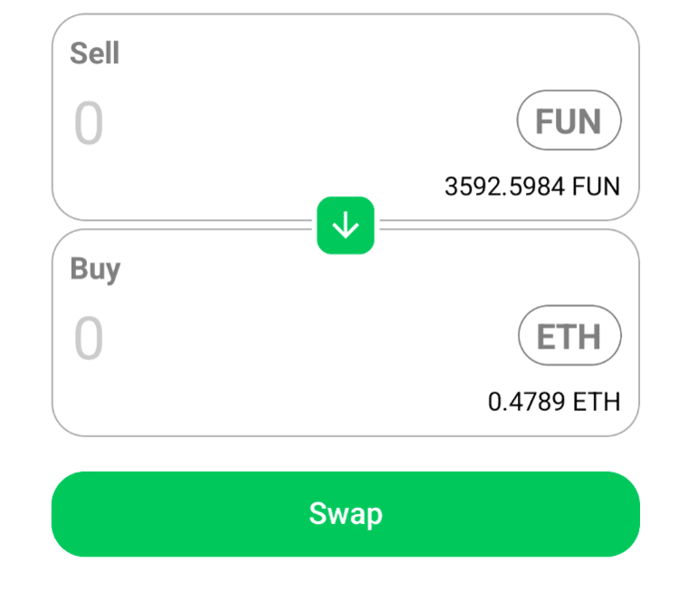

# 🤫 Shwap

🧪 **Shwap** is a mobile decentralized exchange allowing anyone to be a Liquidity Provider and swap $ETH for $FUN... literally 🥳

[Watch me swap!](https://youtu.be/2o6DpvqqHrY)

⚙️ **Tech Stack**: Built with React Native, Hardhat, Wagmi, Viem, and TypeScript to streamline mobile dApp development.

### Key Features

- 💰 **Provide Liqudity**: Become a Liquidity Provider by depositing $ETH and $FUN into the protocol.



- 💳 **Withdraw Liquidity**: You can always withdraw your liquidity + rewards.



- ✅ **Swap Tokens**: Swap $ETH for $FUN.



## Requirements

Before you begin, you need to install the following tools:

- [Yarn](https://yarnpkg.com/getting-started/install)
- [Git](https://git-scm.com/downloads)
- [React Native](https://reactnative.dev/docs/environment-setup?guide=native&platform=android)

## Quickstart

To get started with Shwap, follow the steps below:

1. Clone this repo & install dependencies

```
git clone https://github.com/ValentineCodes/shwap.git

cd shwap

yarn install

cd packages/reactnative

npx pod-install
```

2. Connect your device to your computer via WIFI-HOTSPOT

3. Run a local network in the first terminal

```
yarn chain
```

This command starts a local Ethereum network hosted on your local IP address. The network runs on your local machine and can be used for testing and development. You can customize the network configuration in `hardhat.config.ts`.

4. On a second terminal, deploy the test contract:

```
yarn deploy
```

This command deploys a test smart contract to the local network. The contract is located in `packages/hardhat/contracts` and can be modified to suit your needs. The `yarn deploy` command uses the deploy script located in `packages/hardhat/deploy` to deploy the contract to the network. You can also customize the deploy script.

5. Set the `ALCHEMY_KEY` and `LOCAL_PROVIDER`(port **8545**) variables in `packages/reactnative/src/utils/constants.ts`

#### To determine your local IP address:

#### Mac:

```
ipconfig getifaddr en0
```

#### Windows:

```
ipconfig
```

6. Connect your device via USB or Run an emulator

7. Run on device:

#### Android

```
yarn android
```

#### IOS

```
yarn ios
```

8. Import one of the funded accounts in your local blockchain into your wallet to have funds for testing

You can interact with your smart contract using the `Debug Contracts` tab. You can tweak the app config in `packages/reactnative/scaffold.config.ts`.

Run smart contract test with `yarn test`

## Contributing to Shwap

We welcome contributions to Shwap!

Please see [CONTRIBUTING.MD](https://github.com/ValentineCodes/shwap/blob/main/CONTRIBUTING.md) for more information and guidelines for contributing to Shwap.
